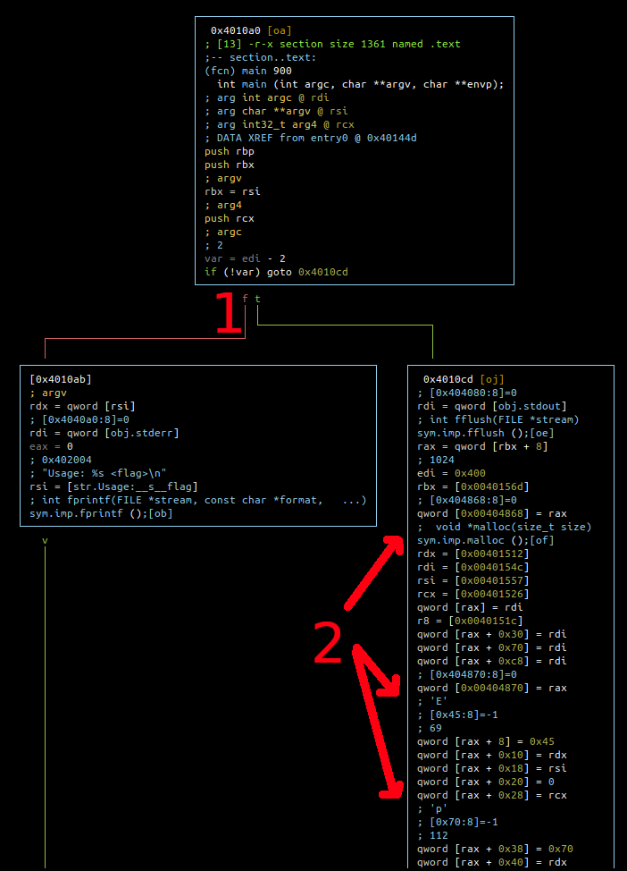
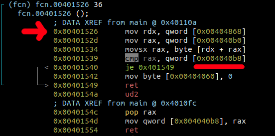

# Description

"The flag doesn't follow any particular format."

# Solution

(Thanks to Simone for the tips... :) )

It's a "crackme",  you give the flag as an argument to the binary
and it tells you if it's right or wrong, so let's try to find the
flag.

I used Radare2 in Debugger mode to solve this one with the help of
Hopper for the disassembly, it took me time to understand the logic
of the program especially as it uses threading (``swapcontext()``)
to obfuscate the password comparison and because I'm quite new to
this (Radare2 steep learning curve doesn't help).

So let's start:

```bash
r2 -d stacked i_dont_know_the_flag_yet
```

Disassemble functions:

```bash
aaa
```

Functions found:

```bash
[0x7fa57bc8a090]> afl
0x00401430    1 42           entry0
0x00401030    1 6            sym.imp.swapcontext
0x00401040    1 6            sym.imp.fputs
0x00401050    1 6            sym.imp.fprintf
0x00401060    1 6            sym.imp.makecontext
0x00401070    1 6            sym.imp.malloc
0x00401080    1 6            sym.imp.fflush
0x00401090    1 6            sym.imp.getcontext
0x004010a0    7 900          main
0x00401510    5 114  -> 51   entry.init0
0x004014e0    3 33   -> 28   entry.fini0
0x00401470    4 33   -> 31   fcn.00401470
```

We can see the threading functions that I was referring to in my intro:

* sym.imp.getcontext
* sym.imp.makecontext
* sym.imp.swapcontext

Let's analyze main() and switch in visual mode

```bash
s main
VV
```



1. So we have a big function at ```0x4010cd``` that is called if we provded 
   something as an argument,  otherwise the programm exits.

2. In ```0x4010cd``` it starts by initializing a 1024B empty buffer and fills
   it with 10 chars ```Ep/_i,lP/N```, that's probably the flag in its
   obfuscated form.

3. After pushing all the chars in the buffer it starts the swapcontext dance
   with getcontext(), then it reallocates a 1024B buffer then calls makecontext(),
   swapcontext() and finally based on the value of ```0x404060``` it either jump
   to 0x401401 anf prints "Bad password!" or goes to 0x401412 and prints "Good job!".

4. Ok so we need to understand what these context functions are doing:

   ```bash
   [0x00401090]> s sym.imp.getcontext
   [0x00401090]> pdf
   ┌ (fcn) sym.imp.getcontext 6
   │   sym.imp.getcontext ();
   │ bp: 0 (vars 0, args 0)
   │ sp: 0 (vars 0, args 0)
   │ rg: 0 (vars 0, args 0)
   │           ; CALL XREF from main @ 0x4013a7
   └           0x00401090      ff25b22f0000   goto qword [reloc.getcontext] ; [0x404048:8]=0x401096
   ```
  
   Ok ... no luck
  
   ```bash
   [0x00401090]> s sym.imp.makecontext
   sym.imp.makecontext   sym.imp.makecontext   
   [0x00401090]> s sym.imp.makecontext
   [0x00401060]> pdf
   ┌ (fcn) sym.imp.makecontext 6
   │   sym.imp.makecontext ();
   │ bp: 0 (vars 0, args 0)
   │ sp: 0 (vars 0, args 0)
   │ rg: 0 (vars 0, args 0)
   │           ; CALL XREF from main @ 0x4013dd
   └           0x00401060      ff25ca2f0000   goto qword [reloc.makecontext] ; [0x404030:8]=0x401066 ; "f\x10@"
   ```
 
   :/

   ```bash
   [0x00401060]> s sym.imp.swapcontext
   [0x00401030]> pdf
   ┌ (fcn) sym.imp.swapcontext 6
   │   sym.imp.swapcontext ();
   │ bp: 0 (vars 0, args 0)
   │ sp: 0 (vars 0, args 0)
   │ rg: 0 (vars 0, args 0)
   │           ; CALL XREF from main @ 0x4013ec
   └           0x00401030      ff25e22f0000   goto qword [reloc.swapcontext] ; [0x404018:8]=0x401036 ; "6\x10@"
   ```

   Ok that's definitely not helping.

5. At that point I tried to set a breakpoint before swapcontext() and follow instruction
   by instruction where the program would bring me. I ended up somewhere in a completely
   different address-space (due to the new thread?), I saw something interesting at some
   point where I was constantly jumping to the same set of instructions for about 10 times
   (rings any bells ?). So that's probably my loop that validates my flag and there's some
   comparisons happening here (cmp).

6. Using the search function (/ in visual mode) and searching for the ```cmp``` instruction
   we quickly end-up around ```0x401526```,  it compares the content of ```rax``` with the
   content or memory at address ```0x4040b8```.

7. Let's try to put a breakpoint here and see what happens:

   ```bash
   db 0x401526
   ```

8. Now let's start the programm

   ```bash
   dc   
   hit breakpoint at: 401526
   ```

9. Let's continue the programm flow

   ```bash
   [0x7fb9a407f090]> db 0x401526
   [0x7fb9a407f090]> dc
   hit breakpoint at: 401526
   [0x00401526]> dc
   hit breakpoint at: 401526
   ```

10. Mhhh ok we're back at the same breakpoint ? So we're probably in the famous loop !
    Let's try to see if we're hitting the breakpoint 10 times ?

    ```bash
    [0x7fb9a407f090]> db 0x401526
    [0x7fb9a407f090]> dc
    hit breakpoint at: 401526
    [0x00401526]> dc
    hit breakpoint at: 401526
    [0x00401526]> dc
    hit breakpoint at: 401526
    [0x00401526]> dc
    hit breakpoint at: 401526
    [0x00401526]> dc
    hit breakpoint at: 401526
    [0x00401526]> dc
    hit breakpoint at: 401526
    [0x00401526]> dc
    hit breakpoint at: 401526
    [0x00401526]> dc
    hit breakpoint at: 401526
    [0x00401526]> dc
    hit breakpoint at: 401526
    [0x00401526]> dc
    hit breakpoint at: 401526
    [0x00401526]> dc
    hit breakpoint at: 401526
    [0x00401526]> dc
    Bad password!
    ```

    Yes !

11. Point 1 in the picture shows the breakpoint that we're constantly hitting. Point 2 the
    memory address used for the comparison:

    

12. Let's try to see what's the content of ```0x4040b8``` at the first itteration:

    ```
    [0x00401526]> px 4 @0x4040b8
    - offset -   0 1  2 3  4 5  6 7  8 9  A B  C D  E F  0123456789ABCDEF
    0x004040b8  4600 0000                                F...
    ```

    Mhh could it be the first letter of the flag ? Let's continue to the 2nd itteration and
    reprint the content of ```0x4040b8```:

    ```
    [0x00401526]> px 4 @0x4040b8
    - offset -   0 1  2 3  4 5  6 7  8 9  A B  C D  E F  0123456789ABCDEF
    0x004040b8  4600 0000                                F...
    [0x00401526]> dc
    hit breakpoint at: 401526
    [0x00401526]> px 4 @0x4040b8
    - offset -   0 1  2 3  4 5  6 7  8 9  A B  C D  E F  0123456789ABCDEF
    0x004040b8  7200 0000                                r...
    ``` 

    it changed ! Let's continue until the end:

    ```
    [0x00401526]> px 4 @0x4040b8
    - offset -   0 1  2 3  4 5  6 7  8 9  A B  C D  E F  0123456789ABCDEF
    0x004040b8  4600 0000                                F...
    [0x00401526]> dc
    hit breakpoint at: 401526
    [0x00401526]> px 4 @0x4040b8
    - offset -   0 1  2 3  4 5  6 7  8 9  A B  C D  E F  0123456789ABCDEF
    0x004040b8  7200 0000                                r...
    [0x00401526]> dc
    hit breakpoint at: 401526
    [0x00401526]> px 4 @0x4040b8
    - offset -   0 1  2 3  4 5  6 7  8 9  A B  C D  E F  0123456789ABCDEF
    0x004040b8  3300 0000                                3...
    [0x00401526]> dc
    hit breakpoint at: 401526
    [0x00401526]> px 4 @0x4040b8
    - offset -   0 1  2 3  4 5  6 7  8 9  A B  C D  E F  0123456789ABCDEF
    0x004040b8  6100 0000                                a...
    [0x00401526]> dc
    hit breakpoint at: 401526
    [0x00401526]> px 4 @0x4040b8
    - offset -   0 1  2 3  4 5  6 7  8 9  A B  C D  E F  0123456789ABCDEF
    0x004040b8  6b00 0000                                k...
    [0x00401526]> dc
    hit breakpoint at: 401526
    [0x00401526]> px 4 @0x4040b8
    - offset -   0 1  2 3  4 5  6 7  8 9  A B  C D  E F  0123456789ABCDEF
    0x004040b8  3100 0000                                1...
    [0x00401526]> dc
    hit breakpoint at: 401526
    [0x00401526]> px 4 @0x4040b8
    - offset -   0 1  2 3  4 5  6 7  8 9  A B  C D  E F  0123456789ABCDEF
    0x004040b8  6e00 0000                                n...
    [0x00401526]> dc
    hit breakpoint at: 401526
    [0x00401526]> px 4 @0x4040b8
    - offset -   0 1  2 3  4 5  6 7  8 9  A B  C D  E F  0123456789ABCDEF
    0x004040b8  5200 0000                                R...
    [0x00401526]> dc
    hit breakpoint at: 401526
    [0x00401526]> px 4 @0x4040b8
    - offset -   0 1  2 3  4 5  6 7  8 9  A B  C D  E F  0123456789ABCDEF
    0x004040b8  3000 0000                                0...
    [0x00401526]> dc
    hit breakpoint at: 401526
    [0x00401526]> px 4 @0x4040b8
    - offset -   0 1  2 3  4 5  6 7  8 9  A B  C D  E F  0123456789ABCDEF
    0x004040b8  5000 0000                                P...
    [0x00401526]> dc
    hit breakpoint at: 401526
    [0x00401526]> px 4 @0x4040b8
    - offset -   0 1  2 3  4 5  6 7  8 9  A B  C D  E F  0123456789ABCDEF
    0x004040b8  0000 0000                                ....
    [0x00401526]> dc
    Bad password!
    ```
 
13. W00t ! We've got our flag ```Fr3ak1nR0P```` let's try it

    ```
    ./stacked Fr3ak1nR0P
    Good job!
    ```

14. If you remember at point 2 the chars that were initialized with ```Ep/_i,lP/N```
    converting it to Decimal it gives us:

    ```python
    >>> for i in "Ep/_i,lP/N":
    ...   print(i, ord(i))
    ... 
    ('E', 69)
    ('p', 112)
    ('/', 47)
    ('_', 95)
    ('i', 105)
    (',', 44)
    ('l', 108)
    ('P', 80)
    ('/', 47)
    ('N', 78)
    ```
 
    and doing the same with our flag:

    ```python
    >>> for i in "Fr3ak1nR0P":
    ...   print(i, ord(i))
    ... 
    ('F', 70)
    ('r', 114)
    ('3', 51)
    ('a', 97)
    ('k', 107)
    ('1', 49)
    ('n', 110)
    ('R', 82)
    ('0', 48)
    ('P', 80)
    ```

    So there's some logic somewhere that adds a number between 1 and 5 to each one
    of our initial chars. I won't go further for now.


* https://en.wikipedia.org/wiki/Setcontext
* http://rce4fun.blogspot.com/2014/09/windows-internals-look-into-swapcontext.html
