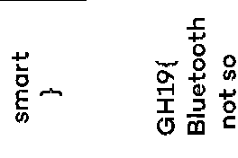

# Description

"You were drinking a well earned coffee when you saw at the neighbouring table
a strange cup. Its owner changed the picture on the side of the mug with his phone.
You happened to sniff Bluetooth traffic while he was doing so. Your goal is to
retrieve the image printed on the cup's screen.
Flag is case sensitive and doesn't contain any spaces."

# Solution

Capture was made using the Nordic BLE Sniffer, to decode properly the fileds inside Wireshark:

1. Go to ```Preferences``` -> ```Protocols``` -> ```DLT_USER``` -> ```DLT Table```  and add a
   new entry for ```DLT User 10 (DLT=157)``` with Payload protocol ```nordic_ble```.

2. Take the first ```Broadcast``` frame comming from ```cd:a2:58:3b:e9:69```, open the ```Link Layer```
   data, we can obtain here the device name: Paulig Muki 3BE96 it's a smartmug, 
   https://www.pauliggroup.com/news/limited-edition-of-the-new-smart-coffee-cup-paulig-muki-now-available

   ```
   0000   f5 06 30 01 56 91 06 0a 01 27 3a 00 00 d4 01 00   õ.0.V....':..Ô..
   0010   00 d6 be 89 8e 40 1d 69 e9 3b 58 a2 cd 13 09 50   .Ö¾..@.ié;X¢Í..P
   0020   41 55 4c 49 47 5f 4d 55 4b 49 5f 33 42 45 39 36   AULIG_MUKI_3BE96
   0030   39 02 01 06 4c 51 76                              9...LQv
   ```

3. In the middle of the file we can see that a device (probably the smarthpone)
   starts a connection request to the mug, it begins with a ```SCAN_REQ``` followed
   by a ```CONNECT_REQ``` and then there's a lot of Master->Slave write
   requests each containing 20 Bytes of data.

4. Let's try to extract this payload using tshark

   ```bash
   tshark -r flag.pcap -T fields -e "btatt.opcode.method" -e "btatt.value" | grep "0x00000012" | awk '{print $2}' | sed  '1d;$d' > data_raw
   ```

   We obtain something like this:

   ```
   ff:ff:ff:ff:ff:ff:ff:ff:ff:ff:ff:ff:ff:ff:ff:ff:ff:ff:ff:ff
   ff:ff:ff:ff:ff:ff:ff:ff:ff:ff:ff:ff:ff:ff:ff:ff:ff:ff:ff:ff
   ff:ff:ff:ff:ff:ff:ff:ff:ff:ff:ff:ff:ff:ff:ff:ff:ff:ff:ff:ff
   ff:ff:ff:ff:ff:ff:ff:ff:ff:ff:ff:ff:ff:ff:ff:ff:ff:ff:ff:ff
   ff:ff:ff:ff:ff:ff:ff:ff:ff:ff:ff:ff:ff:ff:ff:ff:ff:ff:ff:ff
   ff:ff:ff:ff:ff:ff:ff:ff:ff:ff:ff:ff:ff:ff:ff:ff:ff:ff:ff:ff
   ff:ff:ff:ff:ff:ff:ff:ff:ff:ff:ff:ff:ff:ff:ff:ff:ff:ff:ff:ff
   ff:ff:ff:ff:ff:ff:ff:ff:ff:ff:ff:ff:ff:ff:ff:ff:ff:ff:ff:ff
   ff:ff:ff:ff:ff:ff:ff:ff:ff:ff:ff:ff:ff:ff:ff:ff:ff:ff:ff:ff
   ff:ff:ff:ff:ff:ff:ff:ff:ff:ff:ff:ff:ff:ff:ff:ff:ff:ff:ff:ff
   ff:ff:ff:ff:ff:ff:ff:ff:ff:ff:ff:ff:ff:ff:ff:ff:ff:ff:ff:ff
   ff:ff:ff:ff:ff:ff:ff:ff:ff:ff:ff:ff:ff:ff:ff:ff:ff:ff:ff:ff
   ff:ff:ff:ff:ff:ff:ff:ff:ff:ff:ff:ff:ff:ff:ff:ff:ff:ff:ff:ff
   ff:ff:ff:ff:ff:ff:ff:ff:ff:ff:ff:ff:ff:ff:ff:ff:ff:ff:ff:ff
   ff:ff:ff:ff:ff:ff:ff:ff:ff:ff:ff:ff:ff:ff:ff:ff:ff:ff:ff:ff
   ff:ff:ff:ff:ff:ff:ff:ff:ff:ff:ff:ff:ff:ff:ff:ff:ff:ff:ff:ff
   ff:ff:ff:ff:ff:ff:ff:ff:ff:ff:ff:ff:ff:ff:ff:ff:ff:ff:ff:ff
   ff:ff:ff:ff:ff:ff:ff:ff:ff:ff:ff:ff:ff:ff:ff:ff:ff:ff:ff:ff
   ff:ff:ff:ff:ff:ff:ff:ff:ff:ff:ff:ff:ff:ff:ff:ff:ff:ff:ff:ff
   ff:ff:ff:ff:ff:ff:ff:ff:ff:ff:ff:ff:ff:ff:ff:ff:ff:ff:ff:ff
   ff:ff:ff:ff:ff:ff:ff:ff:ff:ff:ff:ff:ff:ff:ff:ff:ff:ff:ff:ff
   ff:ff:ff:ff:ff:ff:ff:ff:ff:ff:ff:ff:ff:ff:ff:ff:ff:ff:ff:ff
   ff:ff:ff:ff:ff:ff:ff:ff:ff:ff:ff:ff:ff:ff:ff:ff:ff:ff:ff:ff
   ff:ff:ff:ff:ff:ff:ff:ff:ff:ff:ff:ff:ff:ff:ff:ff:ff:ff:ff:ff
   ff:ff:ff:ff:ff:ff:ff:ff:ff:ff:ff:ff:ff:ff:ff:ff:ff:ff:ff:ff
   ff:ff:ff:ff:ff:ff:ff:ff:ff:ff:ff:ff:ff:ff:ff:ff:ff:ff:ff:ff
   ff:ff:ff:ff:ff:ff:ff:ff:ff:ff:ff:ff:ff:ff:ff:ff:ff:ff:ff:ff
   ff:ff:ff:ff:ff:ff:ff:ff:ff:ff:ff:ff:ff:ff:ff:ff:ff:ff:ff:ff
   ff:ff:ff:ff:ff:ff:ff:ff:ff:ff:ff:ff:ff:ff:ff:ff:ff:ff:ff:ff
   ff:ff:ff:ff:ff:ff:ff:ff:ff:ff:ff:ff:ff:ff:ff:ff:ff:ff:ff:ff
   ff:ff:ff:ff:ff:ff:ff:ff:ff:ff:ff:ff:ff:ff:ff:ff:ff:ff:ff:ff
   ff:ff:ff:ff:ff:ff:ff:ff:ff:ff:ff:ff:ff:ff:ff:ff:ff:ff:ff:ff
   ff:ff:ff:ff:ff:ff:ff:ff:ff:ff:ff:ff:ff:ff:ff:ff:ff:ff:ff:ff
   ff:ff:ff:ff:ff:ff:ff:ff:ff:ff:ff:ff:ff:ff:ff:ff:ff:ff:ff:ff
   ff:ff:ff:ff:ff:ff:ff:ff:ff:ff:ff:ff:ff:ff:ff:ff:ff:ff:ff:ff
   ff:ff:ff:ff:ff:ff:ff:ff:ff:ff:ff:ff:ff:ff:ff:ff:ff:ff:ff:ff
   ff:ff:ff:ff:ff:ff:ff:ff:ff:ff:ff:ff:ff:ff:ff:ff:ff:ff:ff:ff
   ff:ff:ff:ff:ff:ff:ff:ff:ff:ff:ff:ff:ff:ff:ff:ff:ff:ff:ff:ff
   ff:ff:ff:ff:ff:ff:ff:ff:ff:ff:ff:ff:ff:ff:ff:ff:ff:ff:ff:ff
   ff:ff:ff:ff:ff:ff:ff:ff:ff:ff:ff:ff:ff:ff:ff:ff:ff:ff:ff:ff
   ff:ff:ff:ff:ff:ff:ff:ff:ff:ff:ff:ff:ff:ff:ff:ff:ff:ff:ff:ff
   ff:ff:ff:ff:ff:ff:ff:ff:ff:ff:ff:ff:ff:ff:ff:ff:ff:ff:ff:ff
   ff:ff:ff:ff:ff:ff:7f:fc:ff:ff:ff:ff:ff:ff:ff:ff:ff:ff:ff:ff
   ff:ff:ff:ff:ff:ff:ff:ff:ff:ff:ff:ff:ff:ff:1f:00:00:ff:ff:77
   e0:ff:ff:ff:ff:ff:ff:ff:ff:ff:ff:ff:ff:ff:ff:ff:ff:ff:ff:ff
   ff:ff:ff:ff:ff:ff:ff:1f:00:00:ff:ff:03:c0:ff:ff:ff:ff:ff:ff
   ff:ff:ff:ff:ff:ff:ff:ff:ff:ff:ff:ff:ff:ff:ff:ff:ff:ff:ff:ff
   1f:00:00:ff:ff:01:80:ff:ff:ff:ff:ff:ff:ff:ff:ff:ff:ff:ff:ff
   ff:ff:ff:ff:ff:ff:ff:ff:ff:ff:ff:ff:ff:1f:00:00:ff:ff:c0:07
   ff:ff:ff:ff:ff:ff:ff:ff:ff:ff:ff:ff:ff:ff:ff:ff:ff:ff:ff:ff
   ff:ff:ff:ff:ff:ff:1f:1f:1f:ff:7f:f0:0f:fe:ff:ff:ff:ff:ff:ff
   ff:ff:ff:ff:ff:ff:ff:ff:ff:ff:ff:ff:ff:ff:ff:ff:ff:ff:ff:1f
   1f:1f:ff:7f:f8:1f:fe:ff:ff:ff:ff:ff:ff:ff:ff:ff:ff:ff:ff:ff
   ff:ff:ff:ff:ff:ff:ff:ff:ff:ff:ff:ff:1f:0f:1f:ff:7f:fc:3f:fc
   ff:ff:ff:ff:ff:ff:ff:ff:ff:ff:ff:ff:ff:ff:ff:ff:ff:ff:ff:ff
   ff:07:00:ff:ff:1f:1f:1f:ff:3f:fc:3f:fc:ff:ff:ff:ff:ff:ff:ff
   ff:ff:ff:ff:ff:ff:ff:ff:ff:ff:ff:ff:ff:ff:07:00:ff:ff:1f:1f
   1f:ff:3f:fc:7f:fc:ff:ff:ff:ff:ff:ff:ff:ff:ff:ff:ff:ff:ff:ff
   ff:ff:ff:ff:ff:ff:ff:07:00:ff:ff:1f:0f:1f:ff:3f:3c:7e:fc:ff
   ff:ff:ff:ff:ff:ff:ff:ff:ff:ff:ff:ff:ff:ff:ff:ff:ff:ff:ff:ff
   07:00:ff:ff:1f:0f:0f:ff:3f:3c:7e:fc:ff:ff:ff:ff:ff:ff:ff:ff
   ff:ff:ff:ff:ff:ff:ff:ff:ff:ff:ff:ff:ff:ff:0f:ff:ff:1f:0f:0e
   ff:3f:3c:7e:fc:ff:ff:ff:ff:ff:ff:ff:ff:ff:ff:ff:ff:ff:ff:ff
   ff:ff:ff:ff:ff:ff:ff:1f:ff:ff:1f:06:80:ff:7f:3c:7e:fc:ff:ff
   ff:ff:ff:ff:ff:ff:ff:ff:ff:ff:ff:ff:ff:ff:ff:ff:ff:ff:ff:ff
   1f:ff:ff:1f:40:80:ff:7f:38:3e:fe:ff:ff:ff:ff:ff:ff:ff:ff:ff
   ff:ff:ff:ff:ff:ff:ff:ff:e7:fb:ff:ff:ff:1f:fe:ff:3f:c0:c0:ff
   ff:30:2e:fe:ff:ff:ff:ff:ff:ff:ff:ff:ff:ff:ff:ff:ff:ff:ff:ff
   ff:e3:e3:ff:ff:ff:1f:fe:ff:7f:e0:ff:ff:ff:01:06:ff:ff:ff:ff
   ff:ff:ff:ff:ff:ff:ff:ff:ff:ff:ff:ff:ff:ff:61:c0:ff:ff:ff:0f
   ff:ff:ff:ff:ff:ff:7f:00:86:ff:ff:ff:ff:ff:ff:ff:ff:ff:ff:ff
   ff:ff:ff:ff:ff:ff:ff:71:c0:ff:ff:07:00:ff:ff:ff:ff:ff:ff:7f
   00:c6:ff:ff:ff:ff:ff:ff:ff:ff:ff:ff:ff:ff:ff:ff:ff:ff:ff:ff
   38:8c:ff:ff:07:80:ff:ff:ff:ff:ff:ff:7f:00:e6:ff:ff:ff:ff:ff
   ff:ff:ff:ff:ff:ff:ff:ff:ff:ff:ff:ff:ff:38:8e:ff:ff:07:c0:ff
   ff:1f:c0:0f:fe:ff:ff:ff:ff:ff:ff:ff:ff:ff:ff:ff:ff:ff:ff:ff
   ff:ff:ff:ff:ff:ff:38:8e:ff:ff:07:f0:ff:ff:1f:00:00:fe:ff:ff
   ff:ff:ff:ff:ff:ff:ff:ff:ff:ff:ff:ff:ff:ff:ff:ff:ff:ff:ff:38
   8e:ff:ff:ff:ff:ff:ff:1f:00:00:fe:ff:ff:ff:ff:ff:ff:ff:ff:ff
   ff:ff:ff:ff:ff:ff:ff:ff:ff:ff:ff:ff:19:c6:ff:ff:ff:ff:ff:ff
   1f:00:00:fe:ff:ff:ff:ff:ff:ff:ff:ff:ff:ff:ff:ff:ff:ff:ff:ff
   ff:ff:ff:ff:ff:01:c3:ff:ff:ff:ff:ff:ff:ff:ff:ff:ff:ff:ff:ff
   ff:ff:ff:ff:ff:ff:ff:ff:ff:ff:ff:ff:ff:ff:ff:ff:ff:ff:03:e3
   ff:ff:3f:e0:ff:ff:ff:ff:ff:ff:7f:00:00:fc:ff:ff:ff:ff:ff:ff
   ff:ff:ff:ff:ff:ff:ff:ff:ff:ff:ff:87:f3:ff:ff:1f:c0:ff:ff:ff
   ff:ff:ff:7f:00:00:fc:ff:ff:ff:ff:ff:ff:ff:ff:ff:ff:ff:ff:ff
   ff:ff:ff:ff:ff:ff:ff:ff:1f:80:ff:ff:ff:01:fc:ff:7f:00:00:fc
   ff:ff:ff:ff:ff:ff:ff:ff:ff:ff:ff:ff:ff:ff:ff:ff:ff:ff:ff:ff
   ff:8f:0f:ff:ff:ff:01:fc:ff:ff:3f:fc:ff:ff:ff:ff:ff:ff:ff:ff
   ff:ff:ff:ff:ff:ff:ff:ff:ff:ff:ff:ff:ff:ff:c7:1f:ff:ff:1f:00
   fc:ff:ff:3f:fc:ff:ff:ff:ff:ff:ff:ff:ff:ff:ff:ff:ff:ff:ff:ff
   ff:ff:ff:01:c0:ff:ff:c3:1f:ff:ff:1f:00:fc:ff:ff:3f:fc:ff:ff
   ff:ff:ff:ff:ff:ff:ff:ff:ff:ff:ff:ff:ff:ff:ff:ff:01:c0:ff:ff
   e3:9f:fe:ff:0f:ff:ff:ff:ff:3f:fc:ff:ff:ff:ff:ff:ff:ff:ff:ff
   ff:ff:ff:ff:ff:ff:ff:ff:ff:01:c0:ff:ff:c3:1f:fe:ff:0f:ff:ff
   ff:ff:3f:fc:ff:ff:ff:ff:ff:ff:ff:ff:ff:ff:ff:ff:ff:ff:ff:ff
   ff:ff:ff:c3:ff:ff:c7:1f:ff:ff:8f:ff:ff:ff:ff:3f:fc:ff:ff:ff
   ff:ff:ff:ff:ff:ff:ff:ff:ff:ff:ff:ff:ff:ff:ff:ff:c7:ff:ff:87
   0f:ff:ff:8f:ff:ff:ff:ff:3f:fc:ff:ff:ff:ff:ff:ff:ff:ff:ff:ff
   ff:ff:ff:ff:ff:ff:ff:ff:ff:87:ff:ff:07:02:ff:ff:1f:ff:ff:ff
   ff:3f:fc:ff:ff:ff:ff:ff:ff:ff:ff:ff:ff:ff:ff:ff:ff:ff:ff:ff
   ff:ff:8f:ff:ff:0f:80:ff:ff:1f:fe:ff:ff:ff:3f:fc:ff:ff:ff:ff
   ff:ff:ff:ff:ff:ff:ff:ff:ff:ff:ff:ff:ff:ff:ff:8f:ff:ff:1f:c0
   ff:ff:1f:00:fc:ff:ff:3f:fc:ff:ff:ff:ff:ff:ff:ff:ff:ff:ff:ff
   ff:ff:ff:ff:ff:ff:ff:ff:c7:ff:ff:7f:f0:ff:ff:1f:00:fc:ff:7f
   00:00:fc:ff:ff:ff:ff:ff:ff:ff:ff:ff:ff:ff:ff:ff:ff:ff:ff:ff
   81:c3:ff:ff:ff:ff:ff:ff:1f:00:fc:ff:7f:00:00:fc:ff:ff:ff:ff
   ff:ff:ff:ff:ff:ff:ff:ff:ff:ff:ff:ff:ff:01:e0:ff:ff:ff:1f:ff
   ff:1f:00:fc:ff:7f:00:00:fc:ff:ff:ff:ff:ff:ff:ff:ff:ff:ff:ff
   ff:ff:ff:ff:ff:ff:01:e0:ff:ff:ff:1f:ff:ff:ff:ff:ff:ff:ff:ff
   ff:ff:ff:ff:ff:ff:ff:ff:ff:ff:ff:ff:ff:ff:ff:ff:ff:ff:ff:01
   c0:ff:ff:ff:1f:ff:ff:ff:ff:ff:ff:ff:ff:ff:ff:ff:ff:ff:ff:ff
   ff:ff:ff:ff:ff:ff:ff:ff:ff:ff:ff:ff:ff:c7:ff:ff:3f:00:e0:ff
   ff:ff:ff:ff:ff:ff:ff:ff:ff:ff:ff:ff:ff:ff:ff:ff:ff:ff:ff:ff
   ff:ff:ff:ff:ff:ff:c7:ff:ff:2f:00:e0:ff:ff:80:ff:ff:ff:ff:ff
   ff:ff:ff:ff:ff:ff:ff:ff:ff:ff:ff:ff:ff:c7:ff:ff:f1:ff:ff:c7
   ff:ff:07:00:e0:ff:7f:00:ff:ff:7f:fe:1f:ff:ff:ff:ff:ff:ff:ff
   ff:ff:ff:ff:ff:ff:c7:ff:ff:f0:ff:ff:87:ff:ff:07:00:e0:ff:7f
   00:fe:ff:7f:fe:1f:ff:ff:ff:ff:ff:ff:ff:ff:ff:ff:ff:ff:ff:87
   ff:ff:f0:ff:ff:87:ff:ff:c3:1f:ff:ff:3f:12:fc:ff:7f:fe:1f:ff
   ff:ff:ff:ff:ff:ff:ff:ff:ff:ff:ff:ff:07:80:00:f8:ff:ff:c3:ff
   ff:e3:1f:ff:ff:1f:6b:fc:ff:7f:fe:3f:ff:ff:ff:ff:ff:ff:ff:ff
   ff:ff:ff:ff:ff:0f:80:00:f8:ff:01:c3:ff:ff:c3:1f:ff:ff:8f:63
   fc:ff:7f:fe:3f:fe:ff:ff:ff:ff:ff:ff:ff:ff:ff:ff:ff:ff:1f:80
   00:fe:ff:01:e0:ff:ff:c7:1f:ff:ff:8f:eb:fc:ff:7f:00:00:fc:ff
   ff:ff:ff:ff:ff:ff:ff:ff:ff:ff:ff:ff:1f:fe:ff:ff:01:f8:ff:ff
   e7:3f:ff:ff:8f:eb:fc:ff:7f:00:00:fc:ff:ff:ff:ff:ff:ff:ff:ff
   ff:ff:ff:ff:ff:3f:fe:ff:ff:ff:ff:ff:ff:ff:ff:ff:ff:8f:73:fc
   ff:7f:00:00:fc:ff:ff:ff:ff:ff:ff:ff:ff:ff:ff:ff:ff:ff:3f:fe
   ff:ff:ff:ff:ff:ff:ff:ff:ff:ff:1f:23:fc:ff:7f:fe:ff:ff:ff:ff
   ff:ff:ff:ff:ff:ff:ff:ff:ff:ff:ff:ff:ff:ff:ff:ff:ff:ff:ff:ff
   ff:ff:ff:1f:03:fe:ff:7f:fe:ff:ff:ff:ff:ff:ff:ff:ff:ff:ff:ff
   ff:ff:ff:ff:ff:ff:ff:ff:1f:fc:ff:ff:ff:ff:ff:ff:3f:03:fe:ff
   7f:fe:ff:ff:ff:ff:ff:ff:ff:ff:ff:ff:ff:ff:ff:ff:ff:ff:ff:ff
   ff:07:f0:ff:ff:ff:ff:ff:ff:7f:83:ff:ff:7f:fe:ff:ff:ff:ff:ff
   ff:ff:ff:ff:ff:ff:ff:ff:ff:ff:ff:ff:ff:ff:03:e0:ff:ff:ff:ff
   ff:ff:ff:f7:ff:ff:7f:fe:ff:ff:ff:ff:ff:ff:ff:ff:ff:ff:ff:ff
   ff:ff:ff:ff:ff:ff:ff:01:c0:ff:ff:ff:ff:ff:ff:ff:ff:ff:ff:ff
   ff:c1:ff:ff:ff:ff:ff:ff:ff:ff:ff:ff:ff:ff:ff:ff:ff:ff:ff:ff
   e1:c3:ff:ff:ff:ff:ff:ff:ff:7f:fe:ff:ff:7f:00:ff:ff:ff:ff:ff
   ff:ff:ff:ff:ff:ff:ff:ff:ff:ff:ff:ff:ff:f0:c7:ff:ff:ff:ff:ff
   ff:ff:7f:fc:ff:ff:3f:00:fe:ff:ff:ff:ff:ff:ff:ff:ff:ff:ff:ff
   ff:ff:ff:ff:ff:ff:f8:cf:ff:ff:bf:ff:ff:ff:ff:7f:fc:ff:ff:3f
   18:fe:ff:ff:ff:ff:ff:ff:ff:ff:ff:ff:ff:ff:ff:ff:ff:ff:ff:f8
   8f:ff:ff:bf:83:ff:ff:ff:03:80:ff:7f:3f:3e:fc:ff:ff:ff:ff:ff
   ff:ff:ff:ff:ff:ff:ff:ff:ff:ff:ff:ff:f1:c7:ff:ff:87:01:ff:ff
   1f:00:80:ff:7f:1e:7f:fc:ff:ff:ff:ff:ff:ff:ff:ff:ff:ff:ff:ff
   ff:ff:ff:ff:ff:f1:c7:ff:ff:87:01:ff:ff:1f:00:80:ff:7f:18:ff
   fc:ff:ff:ff:ff:ff:ff:ff:ff:ff:ff:ff:ff:ff:ff:ff:ff:ff:e1:c3
   ff:ff:c3:10:ff:ff:0f:7f:fc:ff:7f:00:ff:fc:ff:ff:ff:ff:ff:ff
   ff:ff:ff:ff:ff:ff:ff:ff:ff:ff:ff:01:c0:ff:ff:e3:38:fe:ff:0f
   7f:fc:ff:ff:00:ff:fc:ff:ff:ff:ff:ff:ff:ff:ff:ff:ff:ff:ff:ff
   ff:ff:ff:ff:01:c0:ff:ff:e3:38:fe:ff:8f:7f:fc:ff:ff:01:7f:fc
   ff:ff:ff:ff:ff:ff:ff:ff:ff:ff:ff:ff:ff:ff:ff:ff:ff:01:c0:ff
   ff:e3:38:ff:ff:8f:7f:fc:ff:ff:07:7e:fc:ff:ff:ff:ff:ff:ff:ff
   ff:ff:ff:ff:ff:ff:ff:ff:ff:ff:ff:ff:ff:ff:47:18:ff:ff:9f:7f
   fc:ff:ff:0f:30:fe:ff:ff:ff:ff:ff:ff:ff:ff:ff:ff:ff:ff:ff:ff
   ff:ff:ff:ff:ff:ff:ff:07:0c:ff:ff:ff:ff:ff:ff:ff:3f:00:fe:ff
   ff:ff:ff:ff:ff:ff:ff:ff:ff:ff:ff:ff:ff:ff:ff:ff:ff:ff:ff:ff
   07:8c:ff:ff:ff:ff:ff:ff:ff:7f:00:ff:ff:ff:ff:ff:ff:ff:ff:ff
   ff:ff:ff:ff:ff:ff:ff:ff:ff:ff:ff:ff:ff:0f:ce:ff:ff:ff:80:ff
   ff:ff:ff:c3:ff:ff:ff:ff:ff:ff:ff:ff:ff:ff:ff:ff:ff:ff:ff:ff
   ff:ff:01:c0:ff:ff:ff:ff:ff:ff:7f:00:ff:ff:ff:ff:ff:ff:ff:ff
   ff:ff:ff:ff:ff:ff:ff:ff:ff:ff:ff:ff:ff:ff:ff:01:c0:ff:ff:ff
   ff:ff:ff:3f:00:fe:ff:ff:ff:ff:ff:ff:ff:ff:ff:ff:ff:ff:ff:ff
   ff:ff:ff:ff:ff:ff:ff:ff:01:c0:ff:ff:ff:ff:ff:ff:1f:1c:fc:ff
   ff:ff:ff:ff:ff:ff:ff:ff:ff:ff:ff:ff:ff:ff:ff:ff:ff:ff:ff:ff
   ff:fd:e1:ff:ff:3f:e0:ff:ff:1f:7f:fc:ff:ff:3f:fe:ff:ff:ff:ff
   ff:ff:ff:ff:ff:ff:ff:ff:ff:ff:ff:ff:ff:ff:ff:e3:ff:ff:0f:80
   ff:ff:0f:7f:fc:ff:ff:2e:f4:ff:ff:ff:ff:ff:ff:ff:ff:ff:ff:ff
   ff:ff:ff:ff:ff:ff:ff:ff:c7:ff:ff:0f:80:ff:ff:8f:7f:fc:ff:1f
   0e:70:ff:ff:ff:ff:ff:ff:ff:ff:ff:ff:ff:ff:ff:ff:ff:ff:ff:ff
   ff:c7:ff:ff:87:0f:ff:ff:8f:7f:fc:ff:0f:00:00:fe:ff:ff:ff:ff
   ff:ff:ff:ff:ff:ff:ff:ff:ff:ff:ff:ff:ff:ff:c7:ff:ff:c7:1f:ff
   ff:0f:7f:fc:ff:07:c0:00:fc:ff:ff:ff:ff:ff:ff:ff:ff:ff:ff:ff
   ff:ff:ff:ff:ff:ff:ff:ff:ff:ff:c3:1f:ff:ff:1f:7f:fc:ff:c7:ff
   ff:f8:ff:ff:ff:ff:ff:ff:ff:ff:ff:ff:ff:ff:ff:ff:ff:ff:ff:ff
   ff:ff:ff:e3:1f:fe:ff:1f:1c:fc:ff:c3:ff:ff:f0:ff:ff:ff:ff:ff
   ff:ff:ff:ff:ff:ff:ff:ff:ff:ff:ff:ff:ff:ff:ff:ff:c3:1f:ff:ff
   3f:18:fe:ff:ff:ff:ff:ff:ff:ff:ff:ff:ff:ff:ff:ff:ff:ff:ff:ff
   ff:ff:ff:ff:ff:ff:c7:ff:ff:c7:1f:ff:ff:7f:00:ff:ff:ff:ff:ff
   ff:ff:ff:ff:ff:ff:ff:ff:ff:ff:ff:ff:ff:ff:ff:ff:ff:ff:ff:c7
   ff:ff:87:0f:ff:ff:ff:c0:ff:ff:ff:ff:ff:ff:ff:ff:ff:ff:ff:ff
   ff:ff:ff:ff:ff:ff:ff:ff:ff:ff:ff:07:00:f8:ff:07:03:ff:ff:ff
   ff:ff:ff:ff:ff:ff:ff:ff:ff:ff:ff:ff:ff:ff:ff:ff:ff:ff:ff:ff
   ff:ff:ff:ff:05:00:f8:ff:0f:82:ff:ff:ff:ff:ff:ff:ff:ff:ff:ff
   ff:ff:ff:ff:ff:ff:ff:ff:ff:ff:ff:ff:ff:ff:ff:ff:ff:01:00:f8
   ff:1f:c0:ff:ff:ff:c1:ff:ff:ff:ff:ff:ff:ff:ff:ff:ff:ff:ff:ff
   ff:ff:ff:ff:ff:ff:ff:ff:ff:ff:f0:c7:ff:ff:7f:f0:ff:ff:7f:00
   ff:ff:ff:ff:ff:ff:ff:ff:ff:ff:ff:ff:ff:ff:ff:ff:ff:ff:ff:ff
   ff:ff:ff:f0:c7:ff:ff:ff:ff:ff:ff:3f:00:fe:ff:ff:ff:ff:ff:ff
   ff:ff:ff:ff:ff:ff:ff:ff:ff:ff:ff:ff:ff:ff:ff:ff:f0:c7:ff:ff
   ff:ff:ff:ff:1f:00:fc:ff:ff:ff:ff:ff:ff:ff:ff:ff:ff:ff:ff:ff
   ff:ff:ff:ff:ff:ff:ff:ff:ff:f0:c7:ff:ff:ff:ff:ff:ff:1f:3e:fc
   ff:ff:ff:ff:ff:ff:ff:ff:ff:ff:ff:ff:ff:ff:ff:ff:ff:ff:ff:ff
   ff:ff:f1:c7:ff:ff:ff:ff:ff:ff:0f:7f:fc:ff:ff:ff:ff:ff:ff:ff
   ff:ff:ff:ff:ff:ff:ff:ff:ff:ff:ff:ff:ff:ff:ff:ff:ff:ff:ff:ff
   ff:ff:ff:8f:7f:fc:ff:ff:ff:ff:ff:ff:ff:ff:ff:ff:ff:ff:ff:ff
   ff:ff:ff:ff:ff:ff:ff:ff:ff:ff:ff:ff:ff:ff:ff:ff:8f:7f:fc:ff
   ff:ff:ff:ff:ff:ff:ff:ff:ff:ff:ff:ff:ff:ff:ff:ff:ff:ff:ff:ff
   ff:ff:ff:ff:ff:ff:ff:ff:ff:0f:7f:fc:ff:ff:ff:ff:ff:ff:ff:ff
   ff:ff:ff:ff:ff:ff:ff:ff:ff:ff:ff:ff:ff:ff:ff:ff:ff:ff:ff:ff
   ff:ff:1f:7f:fc:ff:ff:ff:ff:ff:ff:ff:ff:ff:ff:ff:ff:ff:ff:ff
   ff:ff:ff:ff:ff:ff:ff:ff:ff:ff:ff:ff:ff:ff:ff:1f:3e:fc:ff:ff
   ff:ff:ff:ff:ff:ff:ff:ff:ff:ff:ff:ff:ff:ff:ff:ff:ff:ff:ff:ff
   ff:ff:ff:ff:ff:ff:ff:ff:3f:38:fe:ff:ff:ff:ff:ff:ff:ff:ff:ff
   ff:ff:ff:ff:ff:ff:ff:ff:ff:ff:ff:ff:ff:ff:ff:ff:ff:ff:ff:ff
   ff:3f:00:ff:ff:ff:ff:ff:ff:ff:ff:ff:ff:ff:ff:ff:ff:ff:ff:ff
   ff:ff:ff:ff:ff:ff:ff:ff:ff:ff:ff:ff:ff:ff:ff:80:ff:ff:ff:ff
   ff:ff:ff:ff:ff:ff:ff:ff:ff:ff:ff:ff:ff:ff:ff:ff:ff:ff:ff:ff
   ff:ff:ff:ff:ff:ff:ff:ff:ff:ff:ff:ff:ff:ff:ff:ff:ff:ff:ff:ff
   ff:ff:ff:ff:ff:ff:ff:ff:ff:ff:ff:ff:ff:ff:ff:ff:ff:ff:ff:ff
   ff:ff:ff:ff:ff:ff:ff:ff:ff:ff:ff:ff:ff:ff:ff:ff:ff:ff:ff:ff
   ff:ff:ff:ff:ff:ff:ff:ff:ff:ff:ff:ff:ff:ff:7f:fc:ff:ff:ff:ff
   ff:ff:ff:ff:ff:ff:ff:ff:ff:ff:ff:ff:ff:ff:ff:ff:ff:ff:ff:ff
   ff:ff:ff:ff:ff:ff:ff:7f:fc:ff:ff:ff:ff:ff:ff:ff:ff:ff:ff:ff
   ff:ff:ff:ff:ff:ff:ff:ff:ff:ff:ff:ff:ff:ff:ff:ff:ff:ff:ff:ff
   7f:fc:ff:ff:ff:ff:ff:ff:ff:ff:ff:ff:ff:ff:ff:ff:ff:ff:ff:ff
   ff:ff:ff:ff:ff:ff:ff:ff:ff:ff:ff:ff:7f:04:80:ff:ff:ff:ff:ff
   ff:ff:ff:ff:ff:ff:ff:ff:ff:ff:ff:ff:ff:ff:ff:ff:ff:ff:ff:ff
   ff:ff:ff:ff:ff:7f:00:80:ff:ff:ff:ff:ff:ff:ff:ff:ff:ff:ff:ff
   ff:ff:ff:ff:ff:ff:ff:ff:ff:ff:ff:ff:ff:ff:ff:ff:ff:ff:1f:00
   80:ff:ff:ff:ff:ff:ff:ff:ff:ff:ff:ff:ff:ff:ff:ff:ff:ff:ff:ff
   ff:ff:ff:ff:ff:ff:ff:ff:ff:ff:ff:0f:7f:fc:ff:ff:ff:ff:ff:ff
   ff:ff:ff:ff:ff:ff:ff:ff:ff:ff:ff:ff:ff:ff:ff:ff:ff:ff:ff:ff
   ff:ff:ff:ff:0f:7f:fc:ff:ff:ff:ff:ff:ff:ff:ff:ff:ff:ff:ff:ff
   ff:ff:ff:ff:ff:ff:ff:ff:ff:ff:ff:ff:ff:ff:ff:ff:ff:8f:7f:fc
   ff:ff:ff:ff:ff:ff:ff:ff:ff:ff:ff:ff:ff:ff:ff:ff:ff:ff:ff:ff
   ff:ff:ff:ff:ff:ff:ff:ff:ff:ff:8f:7f:fc:ff:ff:ff:ff:ff:ff:ff
   ff:ff:ff:ff:ff:ff:ff:ff:ff:ff:ff:ff:ff:ff:ff:ff:ff:ff:ff:ff
   ff:ff:ff:9f:7f:fc:ff:ff:ff:ff:ff:ff:ff:ff:ff:ff:ff:ff:ff:ff
   ff:ff:ff:ff:ff:ff:ff:ff:ff:ff:ff:ff:ff:ff:ff:ff:ff:ff:ff:ff
   ff:ff:ff:ff:ff:ff:ff:ff:ff:ff:ff:ff:ff:ff:ff:ff:ff:ff:ff:ff
   ff:ff:ff:ff:ff:ff:ff:ff:ff:ff:ff:ff:ff:ff:ff:ff:ff:ff:ff:ff
   ff:ff:ff:ff:ff:ff:ff:ff:ff:ff:ff:ff:ff:ff:ff:ff:ff:ff:ff:ff
   ff:ff:ff:ff:ff:ff:ff:ff:ff:ff:ff:ff:ff:ff:ff:ff:ff:ff:ff:ff
   ff:ff:ff:ff:ff:ff:ff:ff:ff:ff:ff:ff:ff:ff:ff:1f:00:00:fe:ff
   ff:ff:ff:ff:ff:ff:ff:ff:ff:ff:ff:ff:ff:ff:ff:ff:ff:ff:ff:ff
   ff:ff:ff:ff:ff:ff:ff:ff:1f:00:00:fe:ff:ff:ff:ff:ff:ff:ff:ff
   ff:ff:ff:ff:ff:ff:ff:ff:ff:ff:ff:ff:ff:ff:ff:ff:ff:ff:ff:ff
   ff:1f:00:00:fe:ff:ff:ff:ff:ff:ff:ff:ff:ff:ff:ff:ff:ff:ff:ff
   ff:ff:ff:ff:ff:ff:ff:ff:ff:ff:ff:ff:ff:ff:ff:3f:fe:ff:ff:ff
   ff:ff:ff:ff:ff:ff:ff:ff:ff:ff:ff:ff:ff:ff:ff:ff:ff:ff:ff:ff
   ff:ff:ff:ff:ff:ff:ff:ff:7f:fe:ff:ff:ff:ff:ff:ff:ff:ff:ff:ff
   ff:ff:ff:ff:ff:ff:ff:ff:ff:ff:ff:ff:ff:ff:ff:ff:ff:ff:ff:ff
   ff:7f:fc:ff:ff:ff:ff:ff:ff:ff:ff:ff:ff:ff:ff:ff:ff:ff:ff:ff
   ff:ff:ff:ff:ff:ff:ff:ff:ff:ff:ff:ff:ff:ff:7f:fc:ff:ff:ff:ff
   ff:ff:ff:ff:ff:ff:ff:ff:ff:ff:ff:ff:ff:ff:ff:ff:ff:ff:ff:ff
   ff:ff:ff:ff:ff:ff:ff:7f:fc:ff:ff:ff:ff:ff:ff:ff:ff:ff:ff:ff
   ff:ff:ff:ff:ff:ff:ff:ff:ff:ff:ff:ff:ff:ff:ff:ff:ff:ff:ff:ff
   7f:fc:ff:ff:ff:ff:ff:ff:ff:ff:ff:ff:ff:ff:ff:ff:ff:ff:ff:ff
   ff:ff:ff:ff:ff:ff:ff:ff:ff:ff:ff:ff:ff:3f:fc:ff:ff:ff:ff:ff
   ff:ff:ff:ff:ff:ff:ff:ff:ff:ff:ff:ff:ff:ff:ff:ff:ff:ff:ff:ff
   ff:ff:ff:ff:ff:1f:00:fc:ff:ff:ff:ff:ff:ff:ff:ff:ff:ff:ff:ff
   ff:ff:ff:ff:ff:ff:ff:ff:ff:ff:ff:ff:ff:ff:ff:ff:ff:ff:1f:00
   fe:ff:ff:ff:ff:ff:ff:ff:ff:ff:ff:ff:ff:ff:ff:ff:ff:ff:ff:ff
   ff:ff:ff:ff:ff:ff:ff:ff:ff:ff:ff:1f:00:ff:ff:ff:ff:ff:ff:ff
   ff:ff:ff:ff:ff:ff:ff:ff:ff:ff:ff:ff:ff:ff:ff:ff:ff:ff:ff:ff
   ff:ff:ff:ff:ff:ff:ff:ff:ff:ff:ff:ff:ff:ff:ff:ff:ff:ff:ff:ff
   ff:ff:ff:ff:ff:ff:ff:ff:ff:ff:ff:ff:ff:ff:ff:ff:ff:ff:ff:ff
   ff:ff:ff:ff:ff:ff:ff:ff:ff:ff:ff:ff:ff:ff:ff:ff:ff:ff:ff:ff
   ff:ff:ff:ff:ff:ff:ff:ff:ff:ff:ff:ff:ff:ff:ff:ff:ff:ff:ff:ff
   ff:ff:ff:ff:ff:ff:ff:ff:ff:ff:ff:ff:ff:ff:ff:ff:ff:ff:ff:ff
   ff:ff:ff:ff:ff:ff:ff:ff:ff:ff:ff:ff:ff:ff:ff:ff:ff:ff:ff:ff
   ff:ff:ff:ff:ff:ff:ff:ff:ff:ff:ff:ff:ff:ff:ff:ff:ff:ff:ff:ff
   ff:ff:ff:ff:ff:ff:ff:ff:ff:ff:ff:ff:ff:ff:ff:ff:ff:ff:ff:ff
   ff:ff:ff:ff:ff:ff:ff:ff:ff:ff:ff:ff:ff:ff:ff:ff:ff:ff:ff:ff
   ff:ff:ff:ff:ff:ff:ff:ff:ff:ff:ff:ff:ff:ff:ff:ff:ff:ff:ff:ff
   ff:ff:ff:ff:ff:ff:ff:ff:ff:ff:ff:ff:ff:ff:ff:ff:ff:ff:ff:ff
   ff:ff:ff:ff:ff:ff:ff:ff:ff:ff:ff:ff:ff:ff:ff:ff:ff:ff:ff:ff
   ff:ff:ff:ff:ff:ff:ff:ff:ff:ff:ff:ff:ff:ff:ff:ff:ff:ff:ff:ff
   ff:ff:ff:ff:ff:ff:ff:ff:ff:ff:ff:ff:ff:ff:ff:ff:ff:ff:ff:ff
   ff:ff:ff:ff:ff:ff:ff:ff:ff:ff:ff:ff:ff:ff:ff:ff:ff:ff:ff:ff
   ff:ff:ff:ff:ff:ff:ff:ff:ff:ff:ff:ff:ff:ff:ff:ff:ff:ff:ff:ff
   ff:ff:ff:ff:ff:ff:ff:ff:ff:ff:ff:ff:ff:ff:ff:ff:ff:ff:ff:ff
   ff:ff:ff:ff:ff:ff:ff:ff:ff:ff:ff:ff:ff:ff:ff:ff:ff:ff:ff:ff
   ff:ff:ff:ff:ff:ff:ff:ff:ff:ff:ff:ff:ff:ff:ff:ff:ff:ff:ff:ff
   ff:ff:ff:ff:ff:ff:ff:ff:ff:ff:ff:ff:ff:ff:ff:ff:ff:ff:ff:ff
   ff:ff:ff:ff:ff:ff:ff:ff:ff:ff:ff:ff:ff:ff:ff:ff:ff:ff:ff:ff
   ff:ff:ff:ff:ff:ff:ff:ff:ff:ff:ff:ff:ff:ff:ff:ff:ff:ff:ff:ff
   ff:ff:ff:ff:ff:ff:ff:ff:ff:ff:ff:ff:ff:ff:ff:ff:ff:ff:ff:ff
   ff:ff:ff:ff:ff:ff:ff:ff:ff:ff:ff:ff:ff:ff:ff:ff:ff:ff:ff:ff
   ff:ff:ff:ff:ff:ff:ff:ff:ff:ff:ff:ff:ff:ff:ff:ff:ff:ff:ff:ff
   ff:ff:ff:ff:ff:ff:ff:ff:ff:ff:ff:ff:ff:ff:ff:ff:ff:ff:ff:ff
   ff:ff:ff:ff:ff:ff:ff:ff:ff:ff:ff:ff:ff:ff:ff:ff:ff:ff:ff:ff
   ff:ff:ff:ff:ff:ff:ff:ff:ff:ff:ff:ff:ff:ff:ff:ff:ff:ff:ff:ff
   ff:ff:ff:ff:ff:ff:ff:ff:ff:ff:ff:ff:ff:ff:ff:ff:ff:ff:ff:ff
   ff:ff:ff:ff:ff:ff:ff:ff:ff:ff:ff:ff:ff:ff:ff:ff:ff:ff:ff:ff
   ff:ff:ff:ff:ff:ff:ff:ff:ff:ff:ff:ff:ff:ff:ff:ff:ff:ff:ff:ff
   ff:ff:ff:ff:ff:ff:ff:ff:ff:ff:ff:ff:ff:ff:ff:ff:ff:ff:ff:ff
   ff:ff:ff:ff:ff:ff:ff:ff:00:00:00:00:00:00:00:00:00:00:00:00
   ```

5. Googling a bit I ended up on that GH page -> https://github.com/akx/Paulig-Muki/blob/master/API.md
   that really helped me to reverse the image, so it's a 176x264
   monochrome image with 1B per pixel. I really "invested" a lot
   time into PIL trying to figure out how to obtain something out
   of this bytestring, after reversing the endian-ness of the
   bytestring my image started to looks familiar... Here's the
   code I ended up with:


   ```python
   #! /usr/bin/python3

   from PIL import Image
   
   data_payload = open("data_raw", "r")
   
   data_converted = []
   
   count = 0
   for line in data_payload:
       for data in line.split(":"):
           data_converted.append(int(data, 16))
           count+=1
   
   data_converted.reverse()
   
   bytestr = bytes(data_converted)
   image = Image.frombytes('1', (264,176), bytestr, 'raw')
   image.save("out.bmp")
   ```

   and the image:

   

   flag = ```GH19{Bluetoothnotsosmart}```

# Refs

* https://datatracker.ietf.org/meeting/interim-2016-t2trg-02/materials/slides-interim-2016-t2trg-2-7
* https://github.com/greatscottgadgets/ubertooth/wiki/One-minute-to-understand-BLE-connection-data-packagebtatt.opcode.method == 0x12
* https://github.com/akx/Paulig-Muki/blob/master/API.md
